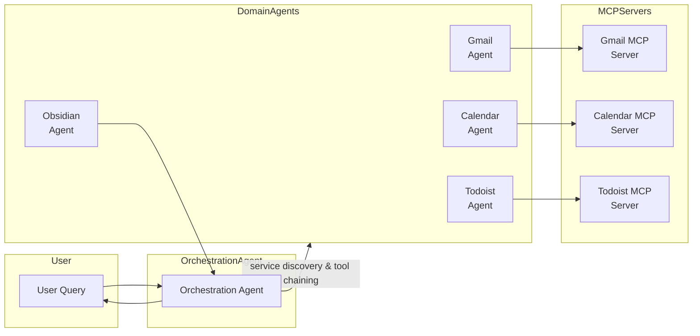

# AI Assistant A2A


> **AI Assistant A2A** is a **privacy-first, multi-agent personal assistant** built on top of [A2A SDK](https://github.com/pydantic/agent2agent) and [Pydantic AI](https://github.com/pydantic/pydantic-ai).  
> It seamlessly connects to Gmail, Google Calendar, Todoist, and an Obsidian knowledge-base to answer questions such as:
>
> • “Do I have any overdue tasks for today?”  
> • “What meetings do I have right after lunch tomorrow?”  
> • “Summarise what we discussed in last week’s project meeting.”
>
> Every capability runs **100 % locally** (unless you choose cloud LLMs), can be containerised, and is orchestrated by a lightweight coordination agent.

---

## ✨ Features

- **🔒 Privacy First**   Run locally, no data leaves your machine unless sent to an LLM provider you configure.
- **🏗 Micro-Service Agents**   Each domain (Gmail, Calendar, Todoist, Obsidian) is an independent Starlette/FastAPI service.
- **🤝 A2A & MCP**   Standardised Agent-to-Agent & Model-Context-Protocol interfaces for discovery + tool-chaining.
- **🧠 LLM Agnostic**   Works with OpenAI, Anthropic, Google Vertex, OpenRouter or any OpenAI-compatible endpoint.
- **📚 Knowledge Retrieval**   GitHub-backed Obsidian vault integration for reading, writing and organising notes.
- **🔌 Extensible**   Add a brand-new agent in ~100 lines of code – orchestration discovers it automatically.

---

## 📚 Table of Contents

1. [Architecture](#architecture)  
2. [Quick Start](#quick-start)  
3. [Configuration](#configuration)  
4. [Running](#running)  
5. [Client CLI](#client-cli)  
6. [Project Structure](#project-structure)  
7. [Adding Agents](#adding-new-agents)  
8. [Development](#development)  
9. [Contributing](#contributing)  
10. [License](#license)

---

## 🏗 Architecture



### Component Overview

| Component | Port | Purpose |
|-----------|------|---------|
| **Gmail Agent** | `10020` | Search, read & send e-mails |
| **Todoist Agent** | `10022` | Task & project management |
| **Calendar Agent** | `10023` | Event retrieval & scheduling |
| **Orchestration Agent** | `10024` | Intent routing and multi-agent workflows |
| **Obsidian Agent** | `10025` | Knowledge management via GitHub-backed vault |

> **Tip:** Ports are configurable via environment variables – see [Configuration](#configuration).

---

## 🚀 Quick Start

### 1. Clone & install

```bash
# Clone repository
$ git clone https://github.com/your-org/ai-asst-a2a.git
$ cd ai-asst-a2a

# Create virtual env
$ python -m venv .venv && source .venv/bin/activate   # Windows: .venv\Scripts\activate

# Install
$ pip install -e .
# – or –
$ poetry install
```

### 2. Configure secrets

Create a `.env` file:

```dotenv
# LLM provider (choose one)
OPENAI_API_KEY=sk-...
# or OPENROUTER_API_KEY=or-...

# Google services
gcp-oauth.keys.json=/absolute/path/to/gcp-oauth.keys.json
GOOGLE_OAUTH_CREDENTIALS=${gcp-oauth.keys.json}

# Todoist
TODOIST_API_TOKEN=xxxxxxxxxxxxxxxxxxxxxxxx

# GitHub (for Obsidian)
GITHUB_TOKEN=ghp_XXXXXXXXXXXXXXXXXXXXXXXXXXXX

# Optional – custom ports
PORT_GMAIL=10020
PORT_TODOIST=10022
PORT_CALENDAR=10023
PORT_OBSIDIAN=10025
PORT_ORCHESTRATION=10024
```

Place your Google OAuth credentials JSON at the path you referenced above.

### 3. Launch everything

```bash
$ python app.py
```

After health-checks you should see:

```
✅ Agent servers are running!
   • Gmail Agent:           http://127.0.0.1:10020
   • Todoist Agent:         http://127.0.0.1:10022
   • Calendar Agent:        http://127.0.0.1:10023
   • Obsidian Agent:        http://127.0.0.1:10025
   • Orchestration Agent:   http://127.0.0.1:10024
```

### 4. Try an interactive chat

```bash
$ python client.py
```

Type a question and watch the orchestration agent coordinate the other services in real-time.

---

## ⚙️ Configuration

All options are exposed via **environment variables** or the per-agent `config.yml` files.

### Important env vars

| Variable | Description | Required |
|----------|-------------|----------|
| `OPENAI_API_KEY` / `OPENROUTER_API_KEY` | API key for your chosen LLM | If using external LLM |
| `GOOGLE_OAUTH_CREDENTIALS` | Path to OAuth JSON with Gmail/Calendar scopes | ✔ |
| `TODOIST_API_TOKEN` | Todoist API token | ✔ |
| `GITHUB_TOKEN` | Personal Access Token for your Obsidian vault repo | ✔ (Obsidian) |
| `PORT_*` | Override default agent ports | ✖ |

### Agent config (`src/agents/**/config.yml`)

```yaml
name: Gmail Agent
model: openai:gpt-4o
host: localhost
port: 10020
system_prompt: |
  You are an e-mail specialist...
```

Modify models, prompts or ports here.

---

## 🏃 Running

### Individual agents (hot-reload)

```bash
uvicorn src.agents.gmail_agent.agent:app        --port 10020 --reload
uvicorn src.agents.calendar_agent.agent:app     --port 10023 --reload
uvicorn src.agents.todoist_agent.agent:app      --port 10022 --reload
uvicorn src.agents.obsidian_agent.agent:app     --port 10025 --reload
uvicorn src.agents.orchestration_agent.agent:app --port 10024 --reload
```

### Docker Compose

```bash
$ docker-compose up --build           # foreground
$ docker-compose up -d                # detached
```

OpenAPI docs for any agent live at `http://localhost:<PORT>/docs`.

---

## 🖥️ Client CLI

`client.py` is a minimal interactive front-end that speaks A2A over HTTP.

```text
You: "Summarise my meetings yesterday"
Agent (thinking…):
  Agent: You had two meetings…
```

It automatically keeps conversation context (task IDs) and prints streaming responses.

---

## 📁 Project Structure

```
ai-asst-a2a
├── app.py                 # Launches & registers all agents
├── client.py              # Interactive CLI
├── docker-compose.yml
├── dockerfile
├── pyproject.toml         # Poetry + PEP 621 metadata
└── src/
    ├── agents/
    │   ├── common/        # Shared agent infra (executor, manager, server helpers)
    │   ├── gmail_agent/
    │   ├── todoist_agent/
    │   ├── calendar_agent/
    │   ├── obsidian_agent/
    │   └── orchestration_agent/
    ├── core/              # llms.py, logger.py
    └── mcp_servers/       # Low-level MCP implementations (gmail.py, gcal.py, todoist.py)
```

### 🔍 Under the Hood: How the Code Fits Together

**1. Core plumbing (`src/agents/common/`)**

| File | Purpose |
|------|---------|
| `agent.py` | Loads each agent’s `config.yml` (via `BaseAgentConfig`) and provides `run_agent_in_background()` to spin up a Uvicorn server in its own thread. |
| `agent_manager.py` | Global registry – stores the *card-class* & *agent-instance* for every service. Returns a list that `app.py` uses to boot all agents. |
| `server.py` | Wraps any Pydantic-AI agent into an **A2A**‐compatible Starlette app (`create_agent_a2a_server`). |
| `agent_executor.py` | Generic executor that: ① queues an A2A task, ② spins up MCP servers (if possible), ③ calls the agent, ④ streams artifacts & status back. Includes a fallback when subprocesses aren’t allowed in background threads. |
| `tool_client.py` | Lightweight async A2A client helpers (used by orchestration agent and tests). |

**2. Domain agent pattern**

Every folder like `gmail_agent/`, `calendar_agent/`, etc. follows the same template:

```
<agent_name>/
├── agent.py      # Declares tools with @agent.tool and exports `app = agent.to_a2a()`
├── config.yml    # Name / description / model / port / system_prompt
└── tools.py      # Extra helpers (only when needed, e.g. Gmail API wrappers)
```

Because all agents conform to this structure the orchestration layer can auto-discover and chain tools across services.

**3. Application launcher (`app.py`)**

1. Registers every domain agent + the orchestration agent inside the global `AgentManager`.
2. Iterates over the registry and starts each server in its own *daemon thread*.
3. Polls `/.well-known/agent.json` until all services report healthy, then prints the port table.
4. Adds the running agents to a shared `a2a_client` so that agents can call each other.

**4. Client CLI (`client.py`)**

A minimal interactive REPL that:
* Reads the orchestration agent’s host/port from its YAML
* Maintains `task_id` so every follow-up stays in the same context
* Prints streaming responses or task status updates

Great for quick manual testing without writing any code.

**5. Supporting utilities**

* `src/core/llms.py` – Centralises OpenAI / Anthropic / Vertex etc. client configuration.
* `src/core/logger.py` – Configures Logfire; every thread logs to the same sink.
* `src/mcp_servers/` – Thin wrappers exposing Gmail, Google Calendar & Todoist via **Model Context Protocol**.

---

## ➕ Adding New Agents

1. **Scaffold**
   ```bash
   mkdir -p src/agents/weather_agent
   cp -r src/agents/common/template/* src/agents/weather_agent/
   ```
2. **Edit `config.yml`** – pick a model & port.
3. **Implement `agent.py`** – declare tools with `@agent.tool` decorators.
4. **Import & register** the agent in `app.py`.  
   The orchestration agent will automatically discover and call it.

> See `src/agents/obsidian_agent/` for a fully-featured reference implementation.

---

## 👩‍💻 Development

```bash
# Run formatting, linting & tests
$ ruff format . && ruff check . && mypy src && pytest
```

Dev-extras (ruff, black, mypy, pytest) install via:

```bash
poetry install --with dev
```

Logs are captured with **Logfire**; set `LOGFIRE_TOKEN` to stream to the hosted dashboard.

---

## 🤝 Contributing

We love contributions!  
Check [open issues](https://github.com/your-org/ai-asst-a2a/issues), create a feature branch, use conventional commits, add tests, open a PR – and join the discussion.

> **Code of Conduct**: By participating you agree to follow the [Contributor Covenant](https://www.contributor-covenant.org/).

---

## 📅 Roadmap

- [ ] Replace polling health-checks with proper async readiness probes
- [ ] Expand Obsidian agent with vector-search and embeddings
- [ ] Add Slack / Discord notification agent
- [ ] Automatic deployment manifests (Helm & K8s)

---

## 📜 License

Distributed under the **MIT license**. See [`LICENSE`](LICENSE) for more information.

---

> Built with ❤️ by [Your Name](https://github.com/your-handle) and the amazing open-source community.
